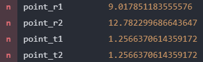

---
# Front matter
lang: ru-RU
title: "Отчёт по лабораторной работе 2"
subtitle: "Задача о погоне"
author: "Калинина Кристина Сергеевна"

# Formatting
toc-title: "Содержание"
toc: true # Table of contents
toc_depth: 2
lof: true # List of figures
lot: true # List of tables
fontsize: 12pt
linestretch: 1.5
papersize: a4paper
documentclass: scrreprt
polyglossia-lang: russian
polyglossia-otherlangs: english
mainfont: PT Serif
romanfont: PT Serif
sansfont: PT Sans
monofont: PT Mono
mainfontoptions: Ligatures=TeX
romanfontoptions: Ligatures=TeX
sansfontoptions: Ligatures=TeX,Scale=MatchLowercase
monofontoptions: Scale=MatchLowercase
indent: true
pdf-engine: lualatex
header-includes:
  - \linepenalty=10 # the penalty added to the badness of each line within a paragraph (no associated penalty node) Increasing the value makes tex try to have fewer lines in the paragraph.
  - \interlinepenalty=0 # value of the penalty (node) added after each line of a paragraph.
  - \hyphenpenalty=50 # the penalty for line breaking at an automatically inserted hyphen
  - \exhyphenpenalty=50 # the penalty for line breaking at an explicit hyphen
  - \binoppenalty=700 # the penalty for breaking a line at a binary operator
  - \relpenalty=500 # the penalty for breaking a line at a relation
  - \clubpenalty=150 # extra penalty for breaking after first line of a paragraph
  - \widowpenalty=150 # extra penalty for breaking before last line of a paragraph
  - \displaywidowpenalty=50 # extra penalty for breaking before last line before a display math
  - \brokenpenalty=100 # extra penalty for page breaking after a hyphenated line
  - \predisplaypenalty=10000 # penalty for breaking before a display
  - \postdisplaypenalty=0 # penalty for breaking after a display
  - \floatingpenalty = 20000 # penalty for splitting an insertion (can only be split footnote in standard LaTeX)
  - \raggedbottom # or \flushbottom
  - \usepackage{float} # keep figures where there are in the text
  - \floatplacement{figure}{H} # keep figures where there are in the text
---

# Цель работы

Решить представленную задачу с помощью уровнения и построить траекторию движения.

# Задание

1. Запишите уравнение, описывающее движение катера, с начальными
условиями для двух случаев (в зависимости от расположения катера
относительно лодки в начальный момент времени).

2. Постройте траекторию движения катера и лодки для двух случаев.

3. Найдите точку пересечения траектории катера и лодки 

# Выполнение лабораторной работы

В моей задаче береговая охрана на катере преследовала лодку браконьеров. 
Чтобы катер траектория катера пересеклась с траекторие лодки, нужно чтобы и катер, и лодка всё время были на одном расстоянии от полюса theta.
Поэтому катер береговой охраны в начале своего пути должен двигаться прямолинейно, пока не окажется на том же расстоянии от полюса, что и лодка браконьеров. 
А уже после этого катер береговой охраны должен двигаться вокруг полюса удаляясь от него с той же скоростью, что и лодка браконьеров.

Также введу 2 необходимых в рамках этой задачи понятия:

Радиальная скорость - это скорость, с которой катер удаляется от полюса.
Тангенциальная скорость – это линейная скорость вращения катера относительно полюса.

1. В самом начале я разобрала представленный в работе материал и построила уравнения для нахождения расстояния, после которого катер начнет двигаться вокруг полюса.
В зависимости от начального положения катера относительно полюса я получила 2 уравнения
(fig. -@fig:001).

{ #fig:001 width=70% }

2. Затем, я вывела уравнение тангенциальной скорости двумя способами, объединив их я получила зависимость радиальной скорости от угла (theta) и радиуса (r)
(fig. -@fig:002).

{ #fig:002 width=70% }

3. Последним шагом я решила систему из двух дифференциальных уравнений и получила уравнение траектории движения катера в полярных координатах
(fig. -@fig:003).

{ #fig:003 width=70% }

4. Дальше с помощью языка julia я написала код к этой задачи, чтобы построить траекторию движения катера и лодки в двух случаях 
(fig. -@fig:004 , -@fig:005).

{ #fig:004 width=70% }

{ #fig:005 width=70% }

5. Дописав необходимый кусочек кода я вычислила точку пересечения для каждого случая: point_r - расстояние от начала координат и point_t - угол theta
(fig. -@fig:006 , -@fig:007).

{ #fig:006 width=70% }

{ #fig:007 width=70% }

# Выводы

Таким образом я решила поставленную задачу и построила траекторию движения катера, используя язык julia.
