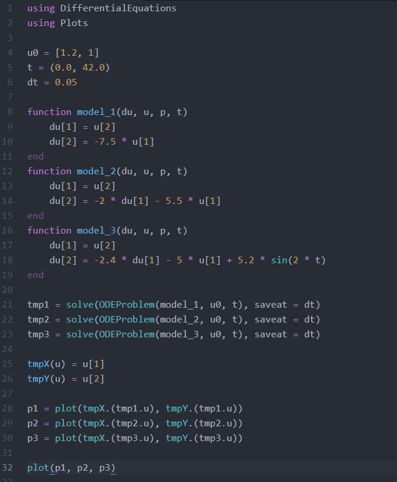
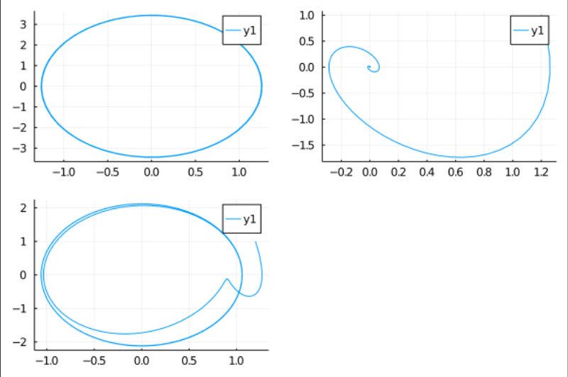

---
## Front matter
lang: ru-RU
title: "Лабораторная работе 4"
subtitle: "Модель гармонического осциллятора"
author: "Калинина Кристина Сергеевна"

## Formatting
toc: false
slide_level: 2
theme: metropolis
header-includes: 
 - \metroset{progressbar=frametitle,sectionpage=progressbar,numbering=fraction}
 - '\makeatletter'
 - '\beamer@ignorenonframefalse'
 - '\makeatother'
aspectratio: 43
section-titles: true
---

## Цель работы

Построить модель гармонического осциллятора.

## Выполнение

 1. Рассмотрение теоретической части
 
 2. Написание кода
 
 3. Оформление отчета и презентации

## Результат

В результате я получила рабочий программный код на языке julia, 3 графика для колебаний гармонического осциллятора без затуханий и без действий внешней силы, для колебаний гармонического осциллятора 
c затуханием и без действий внешней силы и для колебаний гармонического осциллятора c затуханием и под 
действием внешней силы, отчет и презентацию.

## Результат код

{ #fig:001 width=70% }

## Результат графики

{ #fig:002 width=70% }

## Выводы

Таким образом я успешно построила модель гармонического осциллятора, используя язык Julia.
