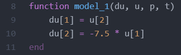
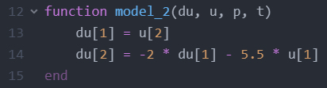
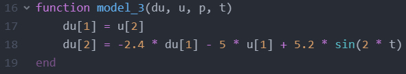
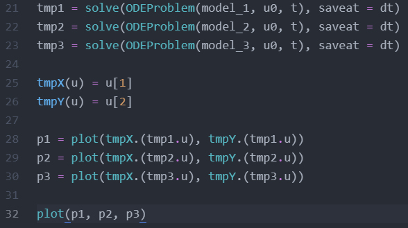
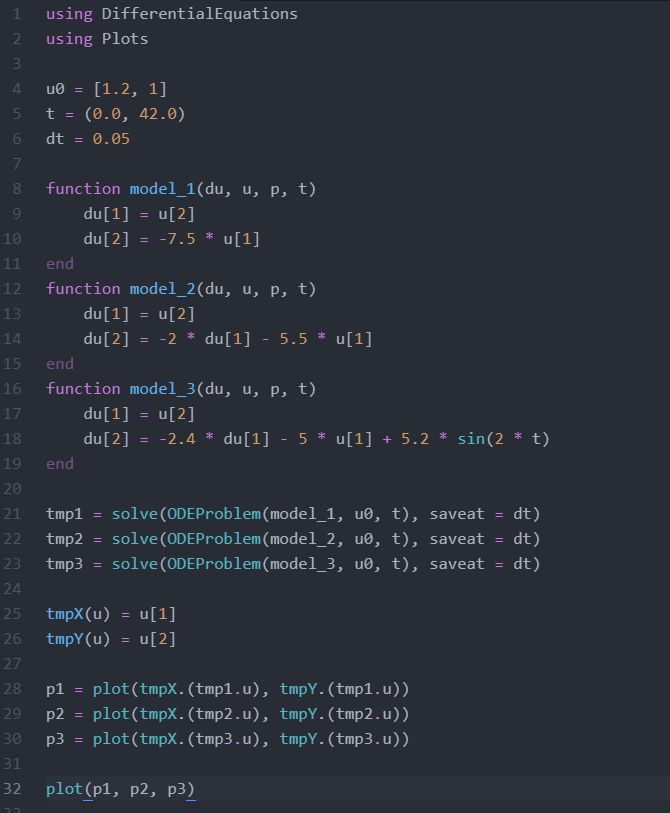
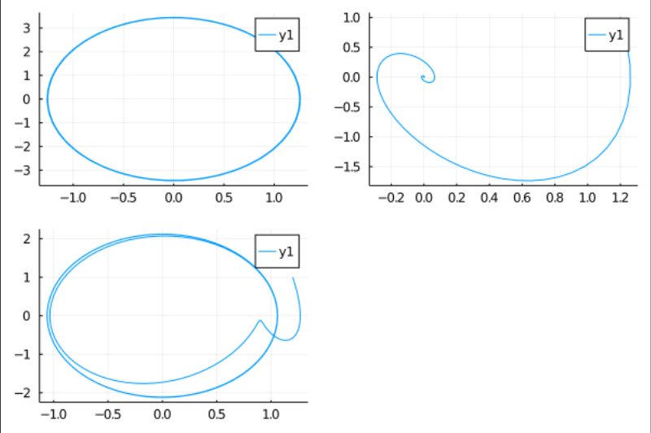
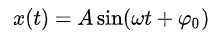

---
# Front matter
lang: ru-RU
title: "Отчёт по лабораторной работе 4"
subtitle: "Модель гармонического осциллятора"
author: "Калинина Кристина Сергеевна"

# Formatting
toc-title: "Содержание"
toc: true # Table of contents
toc_depth: 2
lof: true # List of figures
lot: true # List of tables
fontsize: 12pt
linestretch: 1.5
papersize: a4paper
documentclass: scrreprt
polyglossia-lang: russian
polyglossia-otherlangs: english
mainfont: PT Serif
romanfont: PT Serif
sansfont: PT Sans
monofont: PT Mono
mainfontoptions: Ligatures=TeX
romanfontoptions: Ligatures=TeX
sansfontoptions: Ligatures=TeX,Scale=MatchLowercase
monofontoptions: Scale=MatchLowercase
indent: true
pdf-engine: lualatex
header-includes:
  - \linepenalty=10 # the penalty added to the badness of each line within a paragraph (no associated penalty node) Increasing the value makes tex try to have fewer lines in the paragraph.
  - \interlinepenalty=0 # value of the penalty (node) added after each line of a paragraph.
  - \hyphenpenalty=50 # the penalty for line breaking at an automatically inserted hyphen
  - \exhyphenpenalty=50 # the penalty for line breaking at an explicit hyphen
  - \binoppenalty=700 # the penalty for breaking a line at a binary operator
  - \relpenalty=500 # the penalty for breaking a line at a relation
  - \clubpenalty=150 # extra penalty for breaking after first line of a paragraph
  - \widowpenalty=150 # extra penalty for breaking before last line of a paragraph
  - \displaywidowpenalty=50 # extra penalty for breaking before last line before a display math
  - \brokenpenalty=100 # extra penalty for page breaking after a hyphenated line
  - \predisplaypenalty=10000 # penalty for breaking before a display
  - \postdisplaypenalty=0 # penalty for breaking after a display
  - \floatingpenalty = 20000 # penalty for splitting an insertion (can only be split footnote in standard LaTeX)
  - \raggedbottom # or \flushbottom
  - \usepackage{float} # keep figures where there are in the text
  - \floatplacement{figure}{H} # keep figures where there are in the text
---

# Цель работы

Построить модель гармонического осциллятора.

# Теоретическое введение

Движение грузика на пружинке, маятника, заряда в электрическом контуре, а
также эволюция во времени многих систем в физике, химии, биологии и других
науках при определенных предположениях можно описать одним и тем же
дифференциальным уравнением, которое в теории колебаний выступает в качестве
основной модели. Эта модель называется линейным гармоническим осциллятором.

# Задание

Вариант 40

Постройте фазовый портрет гармонического осциллятора и решение уравнения
гармонического осциллятора для следующих случаев:

1. Колебания гармонического осциллятора без затуханий и без действий внешней
силы x" + 7.5x = 0

2. Колебания гармонического осциллятора c затуханием и без действий внешней
силы x" + 2x' + 5.5х = 0

3. Колебания гармонического осциллятора c затуханием и под действием внешней
силы x" + 2.4x' + 5х = 5.2sin(2t)

На интервале t(0; 42), шаг 0.05 с начальными условиями: x0 = 1.2 , y0 = 1

# Выполнение лабораторной работы

1. Разобрав теорию я приступила к написанию кода на языке Julia.
 Я подключила необходимые библиотеки. Ввела начальные условия (fig. -@fig:001).

{ #fig:001 width=70% }

2. Дальше я написала 3 функции для колебаний гармонического осциллятора без затуханий и без действий внешней силы, для колебаний гармонического осциллятора c затуханием и без действий внешней силы и для колебаний гармонического осциллятора c затуханием и под действием внешней силы(fig. -@fig:002, -@fig:003, -@fig:004).

{ #fig:002 width=70% }

{ #fig:003 width=70% }

{ #fig:004 width=70% }

3. Затем я задала переменные для решений и вывела всё на графики (fig. -@fig:005)

{ #fig:005 width=70% }

3. Финальный код для решения данной задачи (fig. -@fig:006)

{ #fig:006 width=70% }

4. Я получила графики для трёх описаных случаев случаев(fig. -@fig:007).

{ #fig:007 width=70% }

# Выводы

Таким образом я успешно построила модель гармонического осциллятора, используя язык Julia.

# Контрольные вопросы

1. Запишите простейшую модель гармонических колебаний

Простейшая модель гармонических колебаний выглядит следующим образом (fig. -@fig:008): 

{ #fig:008 width=70% }

2. Дайте определение осциллятора

Осциллятор - система, совершающая колебания, то есть показатели которой периодически повторяются во времени.

4. Запишите алгоритм перехода от дифференциального уравнения второго порядка к двум дифференциальным уравнениям первого порядка

У нас есть дифференциальное уравнение второго порядка, делаем для него замену, и переписываем нашу систему уравнений, учитывая эту замену.

5. Что такое фазовый портрет и фазовая траектория?

Фазовый портрет представляет собой геометрическое представление траекторий динамической системы в фазовой плоскости .

Фазовая траектория - кривая в фазовом пространстве, составленная из точек, представляющих состояние динамической системы в последоват. моменты времени в течение всего времени эволюции.