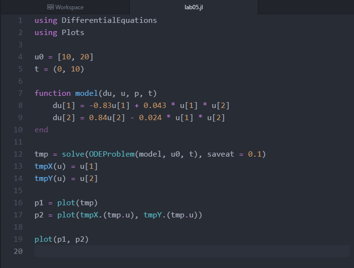
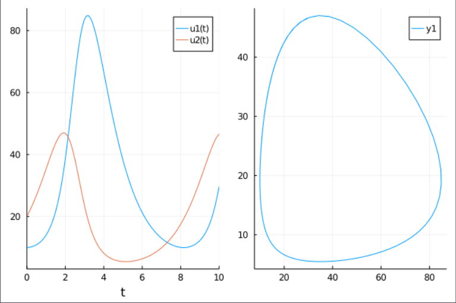

---
## Front matter
lang: ru-RU
title: "Лабораторная работе 5"
subtitle: "Модель хищник-жертва"
author: "Калинина Кристина Сергеевна"

## Formatting
toc: false
slide_level: 2
theme: metropolis
header-includes: 
 - \metroset{progressbar=frametitle,sectionpage=progressbar,numbering=fraction}
 - '\makeatletter'
 - '\beamer@ignorenonframefalse'
 - '\makeatother'
aspectratio: 43
section-titles: true
---

## Цель работы

Изучить модель хищник жертва и применить знания в написании программного кода для заданной системы дифференциальных уравнений.

## Выполнение

 1. Рассмотрение теоретической части
 
 2. Написание кода
 
 3. Оформление отчета и презентации

## Результат

В результате я посчитала стационарную точку, получила рабочий программный код на языке julia, графики зависимости численности хищников от численности жертв,
а также графики изменения численности хищников и численности жертв при следующих начальных условиях: x0 = 10, y0 = 20.

## Результат код

{ #fig:001 width=70% }

## Результат графики

{ #fig:002 width=70% }

## Выводы

Таким образом я успешно построила модель хищник-жертва, используя язык Julia.
