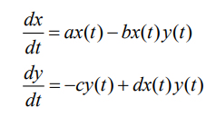
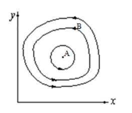
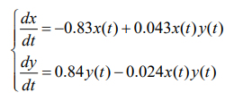
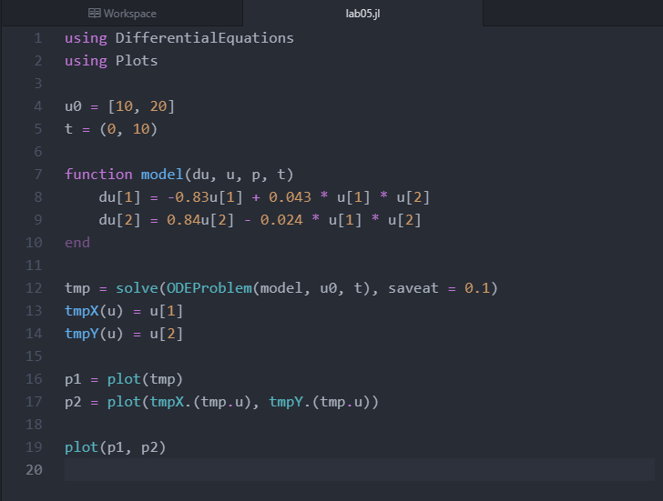
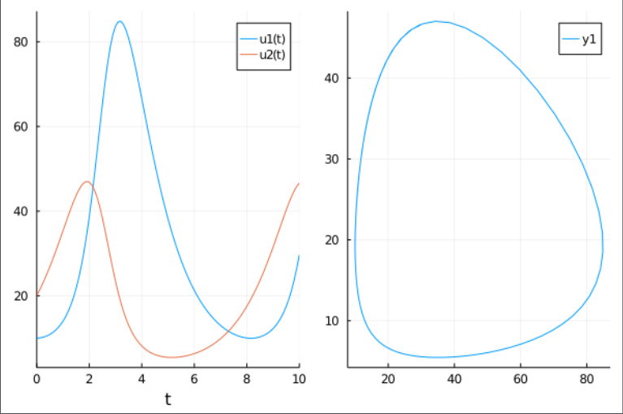

---
# Front matter
lang: ru-RU
title: "Отчёт по лабораторной работе 5"
subtitle: "Модель хищник-жертва"
author: "Калинина Кристина Сергеевна"

# Formatting
toc-title: "Содержание"
toc: true # Table of contents
toc_depth: 2
lof: true # List of figures
lot: true # List of tables
fontsize: 12pt
linestretch: 1.5
papersize: a4paper
documentclass: scrreprt
polyglossia-lang: russian
polyglossia-otherlangs: english
mainfont: PT Serif
romanfont: PT Serif
sansfont: PT Sans
monofont: PT Mono
mainfontoptions: Ligatures=TeX
romanfontoptions: Ligatures=TeX
sansfontoptions: Ligatures=TeX,Scale=MatchLowercase
monofontoptions: Scale=MatchLowercase
indent: true
pdf-engine: lualatex
header-includes:
  - \linepenalty=10 # the penalty added to the badness of each line within a paragraph (no associated penalty node) Increasing the value makes tex try to have fewer lines in the paragraph.
  - \interlinepenalty=0 # value of the penalty (node) added after each line of a paragraph.
  - \hyphenpenalty=50 # the penalty for line breaking at an automatically inserted hyphen
  - \exhyphenpenalty=50 # the penalty for line breaking at an explicit hyphen
  - \binoppenalty=700 # the penalty for breaking a line at a binary operator
  - \relpenalty=500 # the penalty for breaking a line at a relation
  - \clubpenalty=150 # extra penalty for breaking after first line of a paragraph
  - \widowpenalty=150 # extra penalty for breaking before last line of a paragraph
  - \displaywidowpenalty=50 # extra penalty for breaking before last line before a display math
  - \brokenpenalty=100 # extra penalty for page breaking after a hyphenated line
  - \predisplaypenalty=10000 # penalty for breaking before a display
  - \postdisplaypenalty=0 # penalty for breaking after a display
  - \floatingpenalty = 20000 # penalty for splitting an insertion (can only be split footnote in standard LaTeX)
  - \raggedbottom # or \flushbottom
  - \usepackage{float} # keep figures where there are in the text
  - \floatplacement{figure}{H} # keep figures where there are in the text
---

# Цель работы

Изучить модель хищник жертва и применить знания в написании программного кода для заданной системы дифференциальных уравнений.

# Теоретическое введение

Простейшая модель взаимодействия двух видов типа «хищник — жертва» -
модель Лотки-Вольтерры. Данная двувидовая модель основывается на
следующих предположениях:

1. Численность популяции жертв x и хищников y зависят только от времени
(модель не учитывает пространственное распределение популяции на
занимаемой территории)

2. В отсутствии взаимодействия численность видов изменяется по модели
Мальтуса, при этом число жертв увеличивается, а число хищников падает

3. Естественная смертность жертвы и естественная рождаемость хищника
считаются несущественными

4. Эффект насыщения численности обеих популяций не учитывается

5. Скорость роста численности жертв уменьшается пропорционально
численности хищников

В этой модели ((fig. -@fig:001)) x – число жертв, y - число хищников. Коэффициент a
описывает скорость естественного прироста числа жертв в отсутствие хищников, с
- естественное вымирание хищников, лишенных пищи в виде жертв. Вероятность
взаимодействия жертвы и хищника считается пропорциональной как количеству
жертв, так и числу самих хищников (xy). Каждый акт взаимодействия уменьшает
популяцию жертв, но способствует увеличению популяции хищников (члены -bxy
и dxy в правой части уравнения)

{ #fig:001 width=70% }

Математический анализ этой (жесткой) модели показывает, что имеется
стационарное состояние - A (fig. -@fig:002), всякое же другое начальное состояние (B) 
приводит к периодическому колебанию численности как жертв, так и хищников,
так что по прошествии некоторого времени система возвращается в состояние B.

{ #fig:002 width=70% }

# Задание

Вариант 40

Для модели «хищник-жертва»(fig. -@fig:003):

{ #fig:003 width=70% }

# Выполнение лабораторной работы

1. Разобрав теорию я приступила к написанию кода на языке Julia.

2. Стационарную точку я нашла вручную:

x_с = 0,84 / 0,024 = 35 ; y_c = 0,83 / 0,043 = 19,3. 

3. Я подключила необходимые библиотеки, ввела начальные условия, написала функцию для решения 
системы дифференциальных уравнений, нашла её решение и вывела графики на экран. Таким образом я получила 
рабочий программный код для решения поставленной задачи (fig. -@fig:004).

{ #fig:004 width=70% }

4. Я получила графики зависимости численности хищников от численности жертв,
а также графики изменения численности хищников и численности жертв при
следующих начальных условиях: x0 = 10, y0 = 20(fig. -@fig:005).

{ #fig:005 width=70% }

# Выводы

Таким образом я успешно построила модель хищник-жертва, используя язык Julia.
