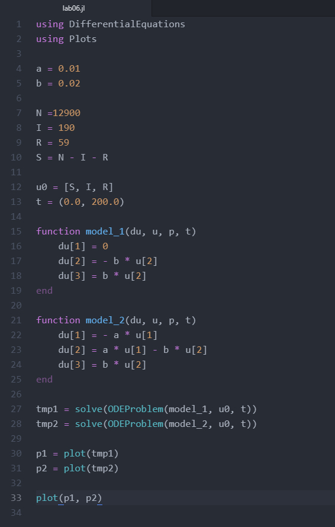
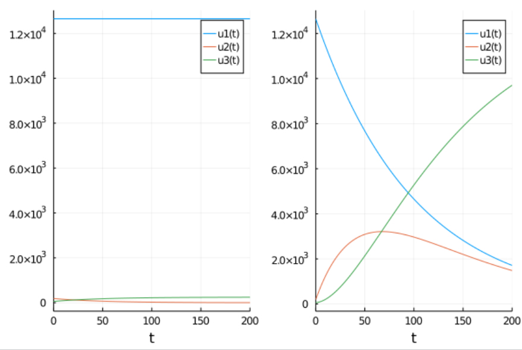

---
## Front matter
lang: ru-RU
title: "Лабораторная работе 6"
subtitle: "Задача об эпидемии"
author: "Калинина Кристина Сергеевна"

## Formatting
toc: false
slide_level: 2
theme: metropolis
header-includes: 
 - \metroset{progressbar=frametitle,sectionpage=progressbar,numbering=fraction}
 - '\makeatletter'
 - '\beamer@ignorenonframefalse'
 - '\makeatother'
aspectratio: 43
section-titles: true
---

## Цель работы

Изучить модель эпидемии и применить знания в написании программного кода для двух случаев.

## Выполнение

 1. Рассмотрение теоретической части
 
 2. Написание кода
 
 3. Оформление отчета и презентации

## Задание

Вариант 40

На одном острове вспыхнула эпидемия. Известно, что из всех проживающих
на острове (N=12 900) в момент начала эпидемии (t=0) число заболевших людей
(являющихся распространителями инфекции) I(0)=190, А число здоровых людей с
иммунитетом к болезни R(0)=59. Таким образом, число людей восприимчивых к
болезни, но пока здоровых, в начальный момент времени S(0)=N-I(0)- R(0).

Постройте графики изменения числа особей в каждой из трех групп.
Рассмотрите, как будет протекать эпидемия в случае:

1. если I(0) <= I*

2. если I(0) > I*

## Результат код

{ #fig:001 width=70% }

## Результат графики

{ #fig:002 width=70% }

## Выводы

Таким образом я успешно построила модель эпидемии, используя язык Julia.