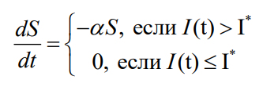
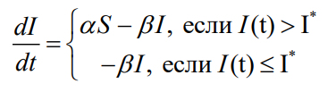
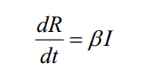
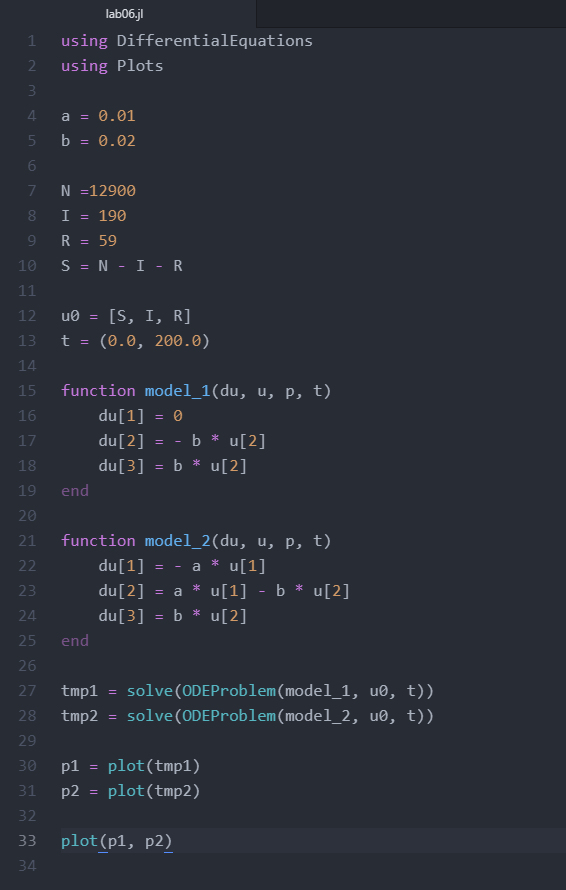
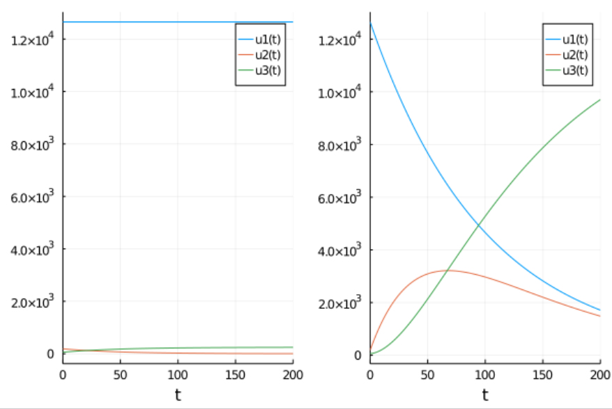

---
# Front matter
lang: ru-RU
title: "Отчёт по лабораторной работе 6"
subtitle: "Задача об эпидемии"
author: "Калинина Кристина Сергеевна"

# Formatting
toc-title: "Содержание"
toc: true # Table of contents
toc_depth: 2
lof: true # List of figures
lot: true # List of tables
fontsize: 12pt
linestretch: 1.5
papersize: a4paper
documentclass: scrreprt
polyglossia-lang: russian
polyglossia-otherlangs: english
mainfont: PT Serif
romanfont: PT Serif
sansfont: PT Sans
monofont: PT Mono
mainfontoptions: Ligatures=TeX
romanfontoptions: Ligatures=TeX
sansfontoptions: Ligatures=TeX,Scale=MatchLowercase
monofontoptions: Scale=MatchLowercase
indent: true
pdf-engine: lualatex
header-includes:
  - \linepenalty=10 # the penalty added to the badness of each line within a paragraph (no associated penalty node) Increasing the value makes tex try to have fewer lines in the paragraph.
  - \interlinepenalty=0 # value of the penalty (node) added after each line of a paragraph.
  - \hyphenpenalty=50 # the penalty for line breaking at an automatically inserted hyphen
  - \exhyphenpenalty=50 # the penalty for line breaking at an explicit hyphen
  - \binoppenalty=700 # the penalty for breaking a line at a binary operator
  - \relpenalty=500 # the penalty for breaking a line at a relation
  - \clubpenalty=150 # extra penalty for breaking after first line of a paragraph
  - \widowpenalty=150 # extra penalty for breaking before last line of a paragraph
  - \displaywidowpenalty=50 # extra penalty for breaking before last line before a display math
  - \brokenpenalty=100 # extra penalty for page breaking after a hyphenated line
  - \predisplaypenalty=10000 # penalty for breaking before a display
  - \postdisplaypenalty=0 # penalty for breaking after a display
  - \floatingpenalty = 20000 # penalty for splitting an insertion (can only be split footnote in standard LaTeX)
  - \raggedbottom # or \flushbottom
  - \usepackage{float} # keep figures where there are in the text
  - \floatplacement{figure}{H} # keep figures where there are in the text
---

# Цель работы

Изучить модель эпидемии и применить знания в написании программного кода для двух случаев.

# Теоретическое введение

Рассмотрим простейшую модель эпидемии. Предположим, что некая
популяция, состоящая из N особей, (считаем, что популяция изолирована)
подразделяется на три группы. Первая группа - это восприимчивые к болезни, но
пока здоровые особи, обозначим их через S(t). Вторая группа – это число
инфицированных особей, которые также при этом являются распространителями
инфекции, обозначим их I(t). А третья группа, обозначающаяся через R(t) – это
здоровые особи с иммунитетом к болезни.

До того, как число заболевших не превышает критического значения I*, 
считаем, что все больные изолированы и не заражают здоровых. Когда I(t) > I*, 
тогда инфицирование способны заражать восприимчивых к болезни особей.

Таким образом, скорость изменения числа S(t) меняется по следующему
закону(fig. -@fig:001):

{ #fig:001 width=70% }

Поскольку каждая восприимчивая к болезни особь, которая, в конце концов,
заболевает, сама становится инфекционной, то скорость изменения числа
инфекционных особей представляет разность за единицу времени между
заразившимися и теми, кто уже болеет и лечится, т.е. (fig. -@fig:002):

{ #fig:002 width=70% }

А скорость изменения выздоравливающих особей, при этом приобретающие
иммунитет к болезни (fig. -@fig:003):

{ #fig:003 width=70% }

Постоянные пропорциональности a,b - это коэффициенты заболеваемости
и выздоровления соответственно.

Для того, чтобы решения соответствующих уравнений определялось
однозначно, необходимо задать начальные условия .Считаем, что на начало
эпидемии в момент времени t = 0 нет особей с иммунитетом к болезни R(0)=0, а
число инфицированных и восприимчивых к болезни особей I(0) и S(0) соответственно.

# Задание

Вариант 40

На одном острове вспыхнула эпидемия. Известно, что из всех проживающих
на острове (N=12 900) в момент начала эпидемии (t=0) число заболевших людей
(являющихся распространителями инфекции) I(0)=190, А число здоровых людей с
иммунитетом к болезни R(0)=59. Таким образом, число людей восприимчивых к
болезни, но пока здоровых, в начальный момент времени S(0)=N-I(0)- R(0).

Постройте графики изменения числа особей в каждой из трех групп.
Рассмотрите, как будет протекать эпидемия в случае:

1. если I(0) <= I*

2. если I(0) > I*

# Выполнение лабораторной работы

1. Разобрав теорию я приступила к написанию кода на языке Julia.

2. Я подключила необходимые библиотеки, ввела начальные условия, написала две функции для решения 
системы дифференциальных уравнений (когда число заболевших меньше критического значения и когда число заболевших больше критического значения), 
нашла решения этих функций и вывела графики на экран. Таким образом я получила 
рабочий программный код для решения поставленной задачи (fig. -@fig:004).

{ #fig:004 width=70% }

3. Я получила графики изменения числа особей в каждой из трех групп для двух случаев(fig. -@fig:005).

{ #fig:005 width=70% }

# Выводы

Таким образом я успешно построила модель эпидемии, используя язык Julia.
