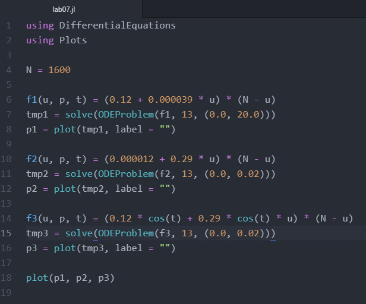
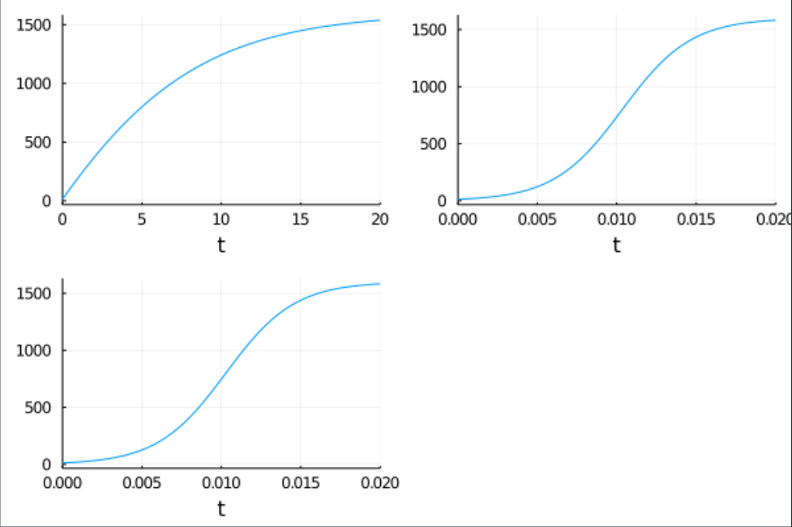

---
## Front matter
lang: ru-RU
title: "Лабораторная работа 7"
subtitle: "Эффективность рекламы"
author: "Калинина Кристина Сергеевна"

## Formatting
toc: false
slide_level: 2
theme: metropolis
header-includes: 
 - \metroset{progressbar=frametitle,sectionpage=progressbar,numbering=fraction}
 - '\makeatletter'
 - '\beamer@ignorenonframefalse'
 - '\makeatother'
aspectratio: 43
section-titles: true
---

## Цель работы

Изучить модель рекламной кампании и применить знания в написании программного кода для трёх случаев.

## Выполнение

 1. Рассмотрение теоретической части
 
 2. Написание кода
 
 3. Оформление отчета и презентации

## Задание

Вариант 40

Постройте график распространения рекламы, математическая модель которой описывается
следующим уравнением:

1. $\frac{dn}{dt} = (0.12 + 0.000039 n(t))(N - n(t))$

2. $\frac{dn}{dt} = (0.000012 + 0.29 n(t))(N - n(t))$

3. $\frac{dn}{dt} = (0.12 cos(t) + 0.29 cos(t) n(t))(N - n(t))$

При этом объем аудитории N = 1600, в начальный момент о товаре 
знает 13 человек. Для случая 2 определите в какой момент времени 
скорость распространения рекламы будет иметь максимальное значение.

## Результат код

{ #fig:001 width=70% }

## Результат графики

{ #fig:002 width=70% }

## Выводы

Таким образом я успешно построила модель рекламной кампании, используя язык Julia.
