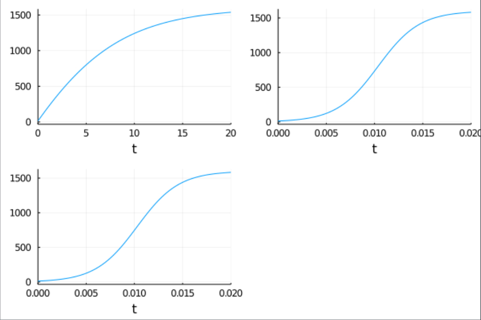

---
# Front matter
lang: ru-RU
title: "Отчёт по лабораторной работе 7"
subtitle: "Эффективность рекламы"
author: "Калинина Кристина Сергеевна"

# Formatting
toc-title: "Содержание"
toc: true # Table of contents
toc_depth: 2
lof: true # List of figures
lot: true # List of tables
fontsize: 12pt
linestretch: 1.5
papersize: a4paper
documentclass: scrreprt
polyglossia-lang: russian
polyglossia-otherlangs: english
mainfont: PT Serif
romanfont: PT Serif
sansfont: PT Sans
monofont: PT Mono
mainfontoptions: Ligatures=TeX
romanfontoptions: Ligatures=TeX
sansfontoptions: Ligatures=TeX,Scale=MatchLowercase
monofontoptions: Scale=MatchLowercase
indent: true
pdf-engine: lualatex
header-includes:
  - \linepenalty=10 # the penalty added to the badness of each line within a paragraph (no associated penalty node) Increasing the value makes tex try to have fewer lines in the paragraph.
  - \interlinepenalty=0 # value of the penalty (node) added after each line of a paragraph.
  - \hyphenpenalty=50 # the penalty for line breaking at an automatically inserted hyphen
  - \exhyphenpenalty=50 # the penalty for line breaking at an explicit hyphen
  - \binoppenalty=700 # the penalty for breaking a line at a binary operator
  - \relpenalty=500 # the penalty for breaking a line at a relation
  - \clubpenalty=150 # extra penalty for breaking after first line of a paragraph
  - \widowpenalty=150 # extra penalty for breaking before last line of a paragraph
  - \displaywidowpenalty=50 # extra penalty for breaking before last line before a display math
  - \brokenpenalty=100 # extra penalty for page breaking after a hyphenated line
  - \predisplaypenalty=10000 # penalty for breaking before a display
  - \postdisplaypenalty=0 # penalty for breaking after a display
  - \floatingpenalty = 20000 # penalty for splitting an insertion (can only be split footnote in standard LaTeX)
  - \raggedbottom # or \flushbottom
  - \usepackage{float} # keep figures where there are in the text
  - \floatplacement{figure}{H} # keep figures where there are in the text
---

# Цель работы

Изучить модель рекламной кампании и применить знания в написании программного кода для трёх случаев.

# Теоретическое введение

Организуется рекламная кампания нового товара или услуги. Необходимо,
чтобы прибыль будущих продаж с избытком покрывала издержки на рекламу.
Вначале расходы могут превышать прибыль, поскольку лишь малая часть
потенциальных покупателей будет информирована о новинке. Затем, при
увеличении числа продаж, возрастает и прибыль, и, наконец, наступит момент,
когда рынок насытиться, и рекламировать товар станет бесполезным.

Модель рекламной кампании описывается следующими величинами.
Считаем, что $\frac{dn}{dt}$ - скорость изменения со временем числа потребителей,
узнавших о товаре и готовых его купить, $t$ - время, прошедшее с начала рекламной
кампании, $n(t)$ - число уже информированных клиентов. Эта величина
пропорциональна числу покупателей, еще не знающих о нем, это описывается
следующим образом: $\alpha_1 (t) (N - n(t))$, где $N$ - общее число потенциальных
платежеспособных покупателей, $\alpha_1 (t) > 0$ - характеризует интенсивность
рекламной кампании (зависит от затрат на рекламу в данный момент времени).
Помимо этого, узнавшие о товаре потребители также распространяют полученную
информацию среди потенциальных покупателей, не знающих о нем (в этом случае
работает т.н. сарафанное радио). Этот вклад в рекламу описывается 
величиной $\alpha_2 (t) n(t) (N - n(t))$, эта величина увеличивается с увеличением потребителей
узнавших о товаре. Математическая модель распространения рекламы описывается
уравнением: $$\frac{dn}{dt} = (\alpha_1 (t) + \alpha_2 (t) n(t))(N - n(t))$$

При $\alpha_1 (t) \gg  \alpha_2 (t)$ получается модель типа модели Мальтуса,
 в обратном случае получаем уравнение логической кривой.

# Задание

Вариант 40

Постройте график распространения рекламы, математическая модель которой описывается
следующим уравнением:

1. $\frac{dn}{dt} = (0.12 + 0.000039 n(t))(N - n(t))$

2. $\frac{dn}{dt} = (0.000012 + 0.29 n(t))(N - n(t))$

3. $\frac{dn}{dt} = (0.12 cos(t) + 0.29 cos(t) n(t))(N - n(t))$

При этом объем аудитории N = 1600, в начальный момент о товаре 
знает 13 человек. Для случая 2 определите в какой момент времени 
скорость распространения рекламы будет иметь максимальное значение.

# Выполнение лабораторной работы

1. Разобрав теорию я приступила к написанию кода на языке Julia.

2. Я подключила необходимые библиотеки, ввела начальные условия, написала три функции для решения 
дифференциальных уравнений, нашла решения этих функций и вывела графики на экран. 
Таким образом я получила рабочий программный код для решения 
поставленной задачи (fig. -@fig:001).

{ #fig:001 width=70% }

3. Я получила графики изменения числа особей в каждой из трех групп для двух случаев(fig. -@fig:002).

{ #fig:002 width=70% }

# Выводы

Таким образом я успешно построила модель рекламной кампании, используя язык Julia.

# Вопросы

1. Записать модель Мальтуса (дать пояснение, где используется данная модель)

Модель Мальтуса выглядят следующим образом:

$$P(t) = P_0 e^{rt},$$

где

- $P_0 = P(0)$ — исходная численность населения,
- $r$ — темп прироста населения («мальтузианский параметр»),
- $t$ — время.

Широко используется в популяционной экологии как первый принцип популяционной динамики

2. Записать уравнение логистической кривой (дать пояснение, что описывает
данное уравнение)

Дифференциальное уравнение выглядит следующим образом:

$$\frac{dP}{dt} = rP (1 - \frac{P}{K}),$$

где

- $P$ - численность популяции
- $t$ - время
- $r$-стратегия предполагает бурное размножение и короткую продолжительность жизни особей
- $K$-стратегия — низкий темп размножения и долгую жизнь.

Исходные предположения для вывода уравнения при рассмотрении популяционной динамики выглядят следующим образом:

- скорость размножения популяции пропорциональна её текущей численности, при прочих равных условиях;
- скорость размножения популяции пропорциональна количеству доступных ресурсов, при прочих равных условиях. Таким образом, второй член уравнения отражает конкуренцию за ресурсы, которая ограничивает рост популяции.

3. На что влияет коэффициент $\alpha_1 (t)$ и $\alpha_2 (t)$ в модели распространения рекламы

$\alpha_1(t)$ - интенсивность рекламной кампании (зависит от затрат)

$\alpha_2(t)$ - интенсивность рекламной кампании (зависит от сарафанного радио)

4. Как ведет себя рассматриваемая модель при $\alpha_1 (t) \gg  \alpha_2 (t)$

Получается модель типа модели Мальтуса, решение которой имеет вид (fig. -@fig:003):

{ #fig:003 width=70% }

5. Как ведет себя рассматриваемая модель при $\alpha_1 (t) \ll  \alpha_2 (t)$

Получается уравнение логической кривой (fig. -@fig:004):

{ #fig:004 width=70% }
