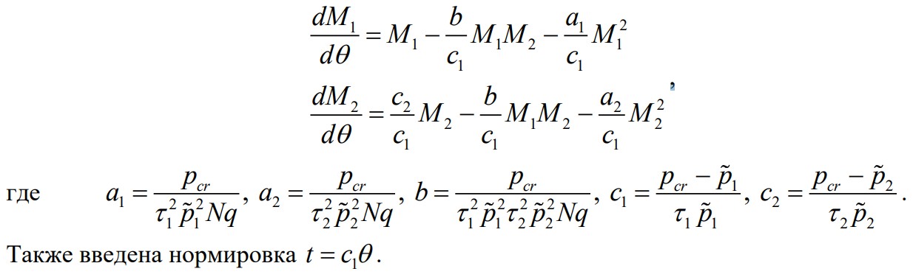
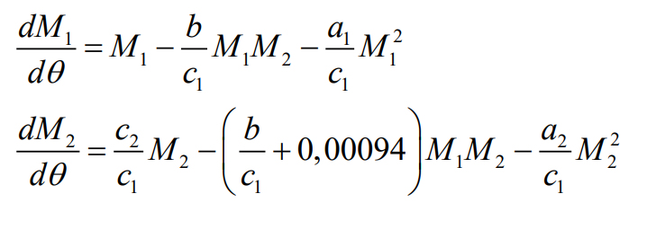
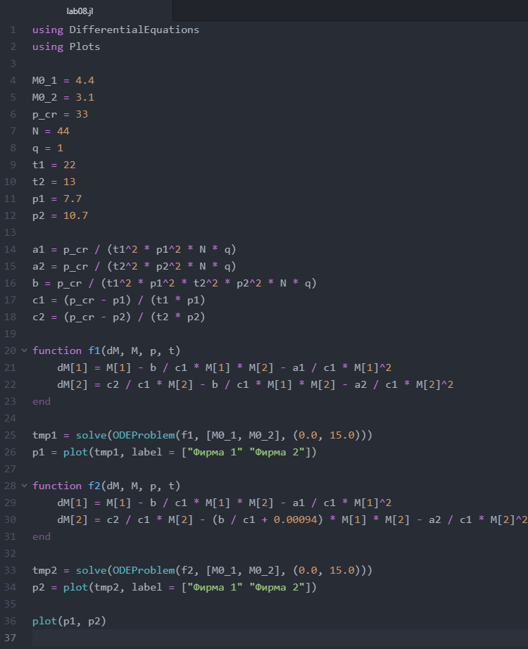
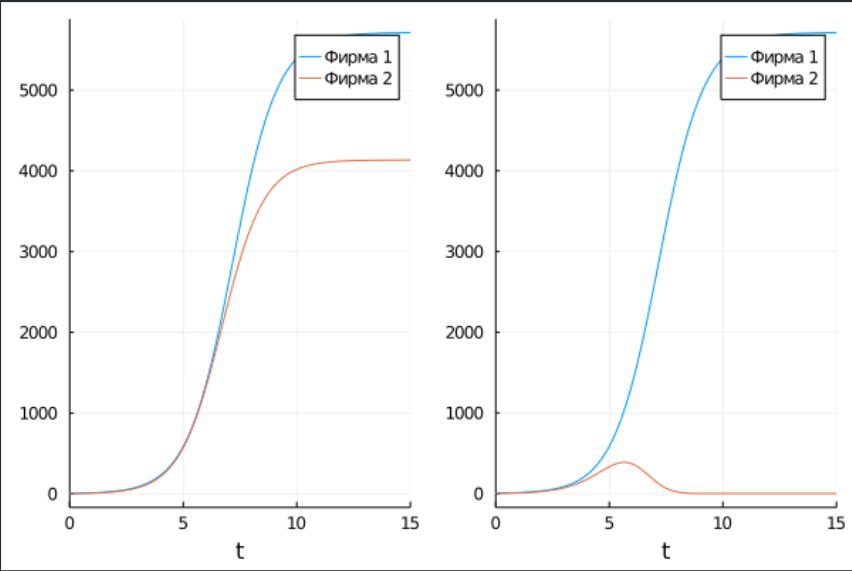

---
## Front matter
lang: ru-RU
title: "Лабораторная работа 8"
subtitle: "Модель конкуренции двух фирм"
author: "Калинина Кристина Сергеевна"

## Formatting
toc: false
slide_level: 2
theme: metropolis
header-includes: 
 - \metroset{progressbar=frametitle,sectionpage=progressbar,numbering=fraction}
 - '\makeatletter'
 - '\beamer@ignorenonframefalse'
 - '\makeatother'
aspectratio: 43
section-titles: true
---

## Цель работы

Изучить модель конкуренции двух фирм и применить знания в написании программного кода для двух случаев.

## Выполнение

 1. Рассмотрение теоретической части
 
 2. Написание кода
 
 3. Оформление отчета и презентации

## Задание. Вариант 40

{ #fig:001 width=80% }

## Задание. Вариант 40

{ #fig:002 width=80% }

## Задание. Вариант 40

1. Постройте графики изменения оборотных средств фирмы 1 и фирмы 2 без
учета постоянных издержек и с веденной нормировкой для случая 1.

2. Постройте графики изменения оборотных средств фирмы 1 и фирмы 2 без
учета постоянных издержек и с веденной нормировкой для случая 2.

## Результат код

{ #fig:004 width=70% }

## Результат графики

{ #fig:005 width=70% }

## Выводы

Таким образом я успешно построила модель конкуренции двух фирм, используя язык Julia.
