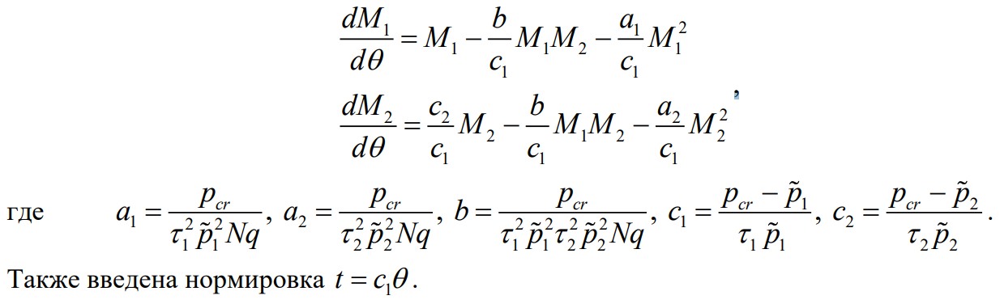
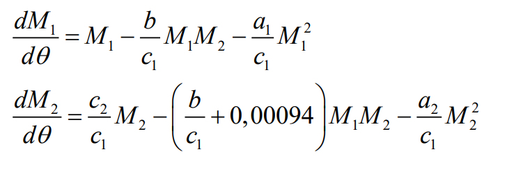
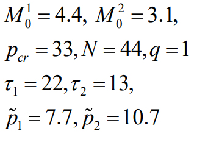
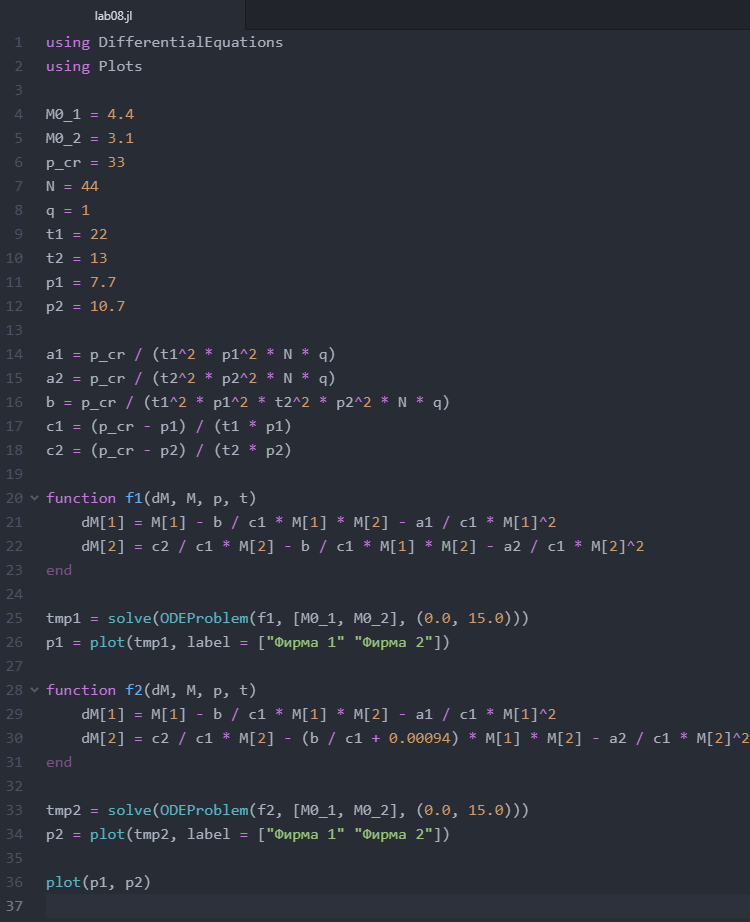
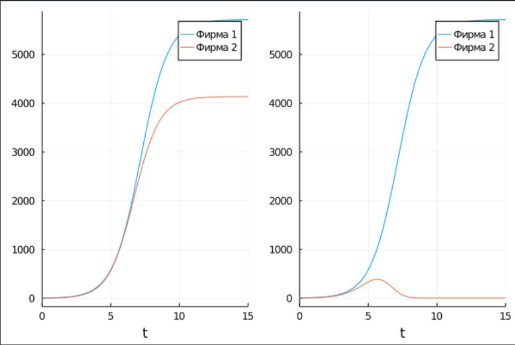

---
# Front matter
lang: ru-RU
title: "Отчёт по лабораторной работе 8"
subtitle: "Модель конкуренции двух фирм"
author: "Калинина Кристина Сергеевна"

# Formatting
toc-title: "Содержание"
toc: true # Table of contents
toc_depth: 2
lof: true # List of figures
lot: true # List of tables
fontsize: 12pt
linestretch: 1.5
papersize: a4paper
documentclass: scrreprt
polyglossia-lang: russian
polyglossia-otherlangs: english
mainfont: PT Serif
romanfont: PT Serif
sansfont: PT Sans
monofont: PT Mono
mainfontoptions: Ligatures=TeX
romanfontoptions: Ligatures=TeX
sansfontoptions: Ligatures=TeX,Scale=MatchLowercase
monofontoptions: Scale=MatchLowercase
indent: true
pdf-engine: lualatex
header-includes:
  - \linepenalty=10 # the penalty added to the badness of each line within a paragraph (no associated penalty node) Increasing the value makes tex try to have fewer lines in the paragraph.
  - \interlinepenalty=0 # value of the penalty (node) added after each line of a paragraph.
  - \hyphenpenalty=50 # the penalty for line breaking at an automatically inserted hyphen
  - \exhyphenpenalty=50 # the penalty for line breaking at an explicit hyphen
  - \binoppenalty=700 # the penalty for breaking a line at a binary operator
  - \relpenalty=500 # the penalty for breaking a line at a relation
  - \clubpenalty=150 # extra penalty for breaking after first line of a paragraph
  - \widowpenalty=150 # extra penalty for breaking before last line of a paragraph
  - \displaywidowpenalty=50 # extra penalty for breaking before last line before a display math
  - \brokenpenalty=100 # extra penalty for page breaking after a hyphenated line
  - \predisplaypenalty=10000 # penalty for breaking before a display
  - \postdisplaypenalty=0 # penalty for breaking after a display
  - \floatingpenalty = 20000 # penalty for splitting an insertion (can only be split footnote in standard LaTeX)
  - \raggedbottom # or \flushbottom
  - \usepackage{float} # keep figures where there are in the text
  - \floatplacement{figure}{H} # keep figures where there are in the text
---

# Цель работы

Изучить модель конкуренции двух фирм и применить знания в написании программного кода для двух случаев.

# Теоретическое введение

Для построения модели конкуренции хотя бы двух фирм необходимо рассмотреть модель одной фирмы. Вначале рассмотрим модель фирмы, производящей продукт долговременного пользования, когда цена его определяется балансом спроса и предложения. Примем, что этот продукт занимает определенную нишу рынка и конкуренты в ней отсутствуют.

Обозначим:

$N$ – число потребителей производимого продукта.

$S$ – доходы потребителей данного продукта. Считаем, что доходы всех потребителей одинаковы. Это предположение справедливо, если речь идет об одной рыночной нише, т.е. производимый продукт ориентирован на определенный слой населения.

$M$ – оборотные средства предприятия

$\tau$ – длительность производственного цикла

$p$ - рыночная цена товара

${\tilde{p}}$ - себестоимость продукта, то есть переменные издержки на производство единицы продукции.

$\delta$ – доля оборотных средств, идущая на покрытие переменных издержек.

$k$ – постоянные издержки, которые не зависят от количества выпускаемой продукции. 

$Q(S/p)$ – функция спроса, зависящая от отношения дохода $S$ к цене $p$. Она равна количеству продукта, потребляемого одним потребителем в единицу времени.

Функцию спроса товаров долговременного использования часто
представляют в простейшей форме:

$$ Q = q - k \frac{p}{S} = q ( 1 - \frac{p}{p_cr} ) $$

где $q$ – максимальная потребность одного человека в продукте в единицу времени.

Эта функция падает с ростом цены и при $p = p_cr$ (критическая стоимость продукта) потребители отказываются от приобретения товара. Величина $p_cr = Sq/k$. Параметр $k$ – мера эластичности функции спроса по цене. Таким образом, функция спроса является пороговой (то есть, $Q(S/p) = 0$ при $p \geq p_cr$) и обладает свойствами насыщения.

# Задание

Вариант 40

Случай 1. Рассмотрим две фирмы, производящие взаимозаменяемые товары одинакового качества и находящиеся в одной рыночной нише. Считаем, что в рамках нашей модели конкурентная борьба ведётся только рыночными методами. То есть, конкуренты могут влиять на противника путем изменения параметров своего производства: себестоимость, время цикла, но не могут прямо вмешиваться в ситуацию на рынке («назначать» цену или влиять на потребителей каким-либо иным способом.) Будем считать, что постоянные издержки пренебрежимо малы, и в модели учитывать не будем. В этом случае динамика изменения объемов продаж фирмы 1 и фирмы 2 описывается следующей системой уравнений (fig. -@fig:001):

{ #fig:001 width=70% }

Случай 2. Рассмотрим модель, когда, помимо экономического фактора влияния (изменение себестоимости, производственного цикла, использование кредита и т.п.), используются еще и социально-психологические факторы – формирование общественного предпочтения одного товара другому, не зависимо от их качества и цены. В этом случае взаимодействие двух фирм будет зависеть друг от друга, соответственно коэффициент перед $M_1 M_2$ будет отличаться. Пусть в рамках рассматриваемой модели динамика изменения объемов продаж фирмы 1 и фирмы 2 описывается следующей системой уравнений(fig. -@fig:002):

{ #fig:002 width=70% }

Для обоих случаев рассмотрим задачу со следующими начальными условиями и параметрами(fig. -@fig:003):

{ #fig:003 width=70% }

Задание:

1. Постройте графики изменения оборотных средств фирмы 1 и фирмы 2 без учета постоянных издержек и с веденной нормировкой для случая 1.

2. Постройте графики изменения оборотных средств фирмы 1 и фирмы 2 без учета постоянных издержек и с веденной нормировкой для случая 2.

# Выполнение лабораторной работы

1. Разобрав теорию я приступила к написанию кода на языке Julia.

2. Я подключила необходимые библиотеки, ввела начальные условия, написала две функции для решения системы дифференциальных уравнений, нашла решения этих систем и вывела графики на экран. Таким образом я получила рабочий программный код для решения поставленной задачи (fig. -@fig:004).

{ #fig:004 width=70% }

3. Я получила график изменения оборотных средств фирмы 1 и фирмы 2 без учета постоянных издержек и с веденной нормировкой для случая 1 и график изменения оборотных средств фирмы 1 и фирмы 2 без учета постоянных издержек и с веденной нормировкой для случая 2(fig. -@fig:002).

{ #fig:005 width=70% }

# Выводы

Таким образом я успешно построила модель конкуренции двух фирм, используя язык Julia.
