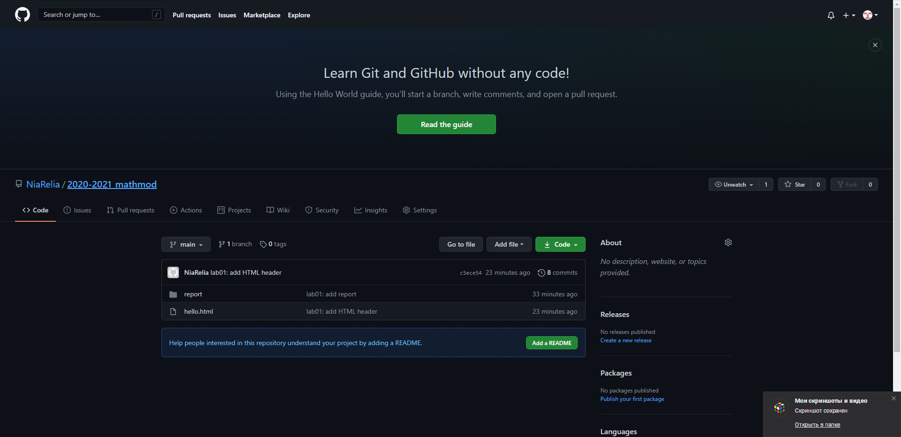

---
## Front matter
lang: ru-RU
title: "Лабораторная работе 1"
subtitle: "Использование git. Использование Markdown для оформления отчётов"
author: "Калинина Кристина Сергеевна"

## Formatting
toc: false
slide_level: 2
theme: metropolis
header-includes: 
 - \metroset{progressbar=frametitle,sectionpage=progressbar,numbering=fraction}
 - '\makeatletter'
 - '\beamer@ignorenonframefalse'
 - '\makeatother'
aspectratio: 43
section-titles: true
---

## GitHub

GitHub — крупнейший веб-сервис для хостинга IT-проектов и их совместной разработки.

## Цель работы

Получить навыки использования git. Получить навыки в написании отчета, используя Markdown.

## Выполнение

  - git init

  - git add

  - git commit

  - git status

  - git log 
  
  - git push

## Результат

{ #fig:001 width=70% }

## Выводы

Таким образом я получила практические навыки работы с git, а также практические навыки использования Markdown для написания текущего отчёта.
