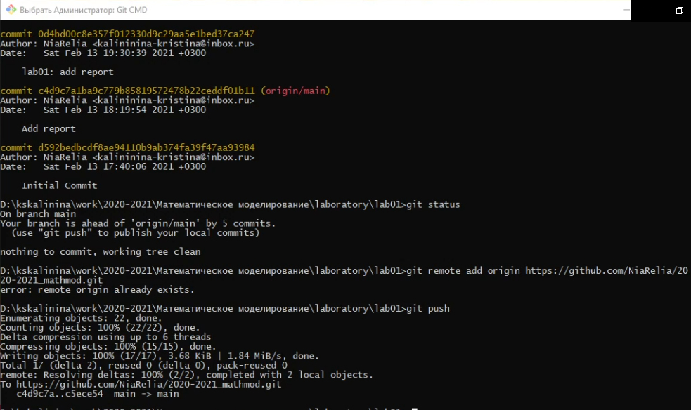

---
# Front matter
lang: ru-RU
title: "Отчёт по лабораторной работе 1"
subtitle: "Использование git. Использование Markdown для оформления отчётов"
author: "Калинина Кристина Сергеевна"

# Formatting
toc-title: "Содержание"
toc: true # Table of contents
toc_depth: 2
lof: true # List of figures
lot: true # List of tables
fontsize: 12pt
linestretch: 1.5
papersize: a4paper
documentclass: scrreprt
polyglossia-lang: russian
polyglossia-otherlangs: english
mainfont: PT Serif
romanfont: PT Serif
sansfont: PT Sans
monofont: PT Mono
mainfontoptions: Ligatures=TeX
romanfontoptions: Ligatures=TeX
sansfontoptions: Ligatures=TeX,Scale=MatchLowercase
monofontoptions: Scale=MatchLowercase
indent: true
pdf-engine: lualatex
header-includes:
  - \linepenalty=10 # the penalty added to the badness of each line within a paragraph (no associated penalty node) Increasing the value makes tex try to have fewer lines in the paragraph.
  - \interlinepenalty=0 # value of the penalty (node) added after each line of a paragraph.
  - \hyphenpenalty=50 # the penalty for line breaking at an automatically inserted hyphen
  - \exhyphenpenalty=50 # the penalty for line breaking at an explicit hyphen
  - \binoppenalty=700 # the penalty for breaking a line at a binary operator
  - \relpenalty=500 # the penalty for breaking a line at a relation
  - \clubpenalty=150 # extra penalty for breaking after first line of a paragraph
  - \widowpenalty=150 # extra penalty for breaking before last line of a paragraph
  - \displaywidowpenalty=50 # extra penalty for breaking before last line before a display math
  - \brokenpenalty=100 # extra penalty for page breaking after a hyphenated line
  - \predisplaypenalty=10000 # penalty for breaking before a display
  - \postdisplaypenalty=0 # penalty for breaking after a display
  - \floatingpenalty = 20000 # penalty for splitting an insertion (can only be split footnote in standard LaTeX)
  - \raggedbottom # or \flushbottom
  - \usepackage{float} # keep figures where there are in the text
  - \floatplacement{figure}{H} # keep figures where there are in the text
---

# Цель работы

Получить навыки использования git. Получить навыки в написании отчета, используя Markdown.

# Задание

Выполнить несколько команд в git-репозитории и выгрузить результат на GitHub.

# Выполнение лабораторной работы

1. Подготовка была выполнена ранее, потому данный пункт был пропущен.

2. Репозиторий был создан, потому перехожу сразу к изменению созданного html файла (fig. -@fig:001).

{ #fig:001 width=70% }

3. Добавила файл в репозиторий и проверила текущее состояние репозитория, чтобы убедиться, что всё прошло успешно. Получила сообщение о том, что коммитить нечего (fig. -@fig:002). 

{ #fig:002 width=70% }

4. Изменила содержание файла hello.html, добавив теги (fig. -@fig:003).

{ #fig:003 width=70% }

5. Просмотрела статус и увидела, что файл был изменен, но эти изменения ещё не зафиксированы в репозитории. Проиндексировала изменения. Проверила статус: файл был проиндексирован, но изменения пока не записаны в репозиторий (fig. -@fig:004).

{ #fig:004 width=70% }

6. Сделала коммит без метки -m и проверила состояние (fig. -@fig:005, -@fig:006).

{ #fig:005 width=70% }

{ #fig:006 width=70% }

7. Изменила hello.html, чтобы он содержал стандартные теги html и body (fig. -@fig:007).

{ #fig:007 width=70% }

8. Добавила это изменение в индекс git (fig. -@fig:008)

{ #fig:008 width=70% }

9. Добавила заголовки HTML в мой файл (fig. -@fig:009)

{ #fig:009 width=70% }

10. Проверила статус. Увидела, что hello.html указан дважды. Первое изменение проиндексировано и готово к коммиту. Второе изменение является непроиндексированным (fig. -@fig:010). 

{ #fig:010 width=70% }

11. Произвела коммит проиндексированного изменения, а затем еще раз проверила состояние. Осталось непроиндексированное изменение. Проиндексировала его, проверила состояние. Закоммитила. Получила сообщение о том, что коммитить нечего (fig. -@fig:011).

{ #fig:011 width=70% }

12. Посмотрела историю, где увидела все внесённые изменения (fig. -@fig:012)

{ #fig:012 width=70% }

13. Выгрузила измененные файлы на GitHub (fig. -@fig:013)

{ #fig:013 width=70% }

14. Проверка файла на GitHub'е (fig. -@fig:014, -@fig:015)

{ #fig:014 width=70% }

{ #fig:015 width=70% }

# Выводы

Таким образом я получила практические навыки работы с git, а также практические навыки использования Markdown для написания текущего отчёта.
